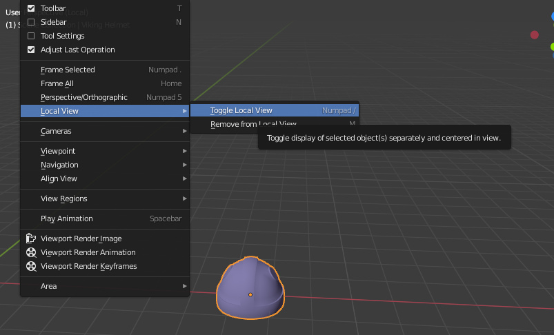
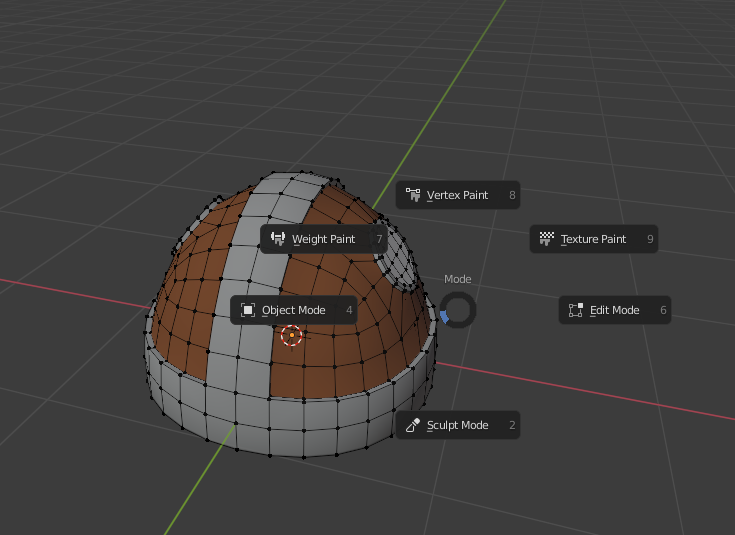
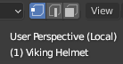
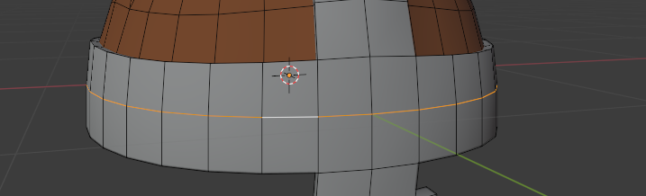
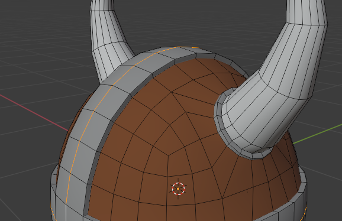
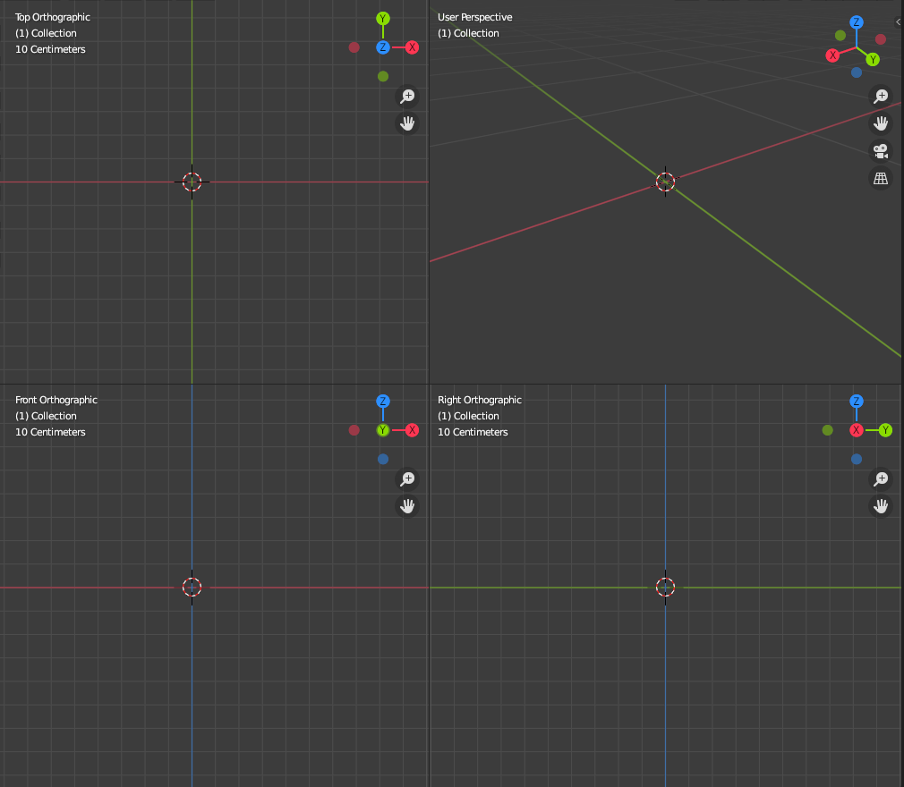
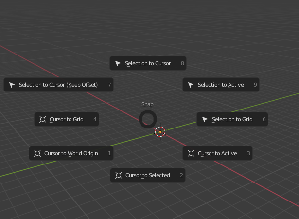
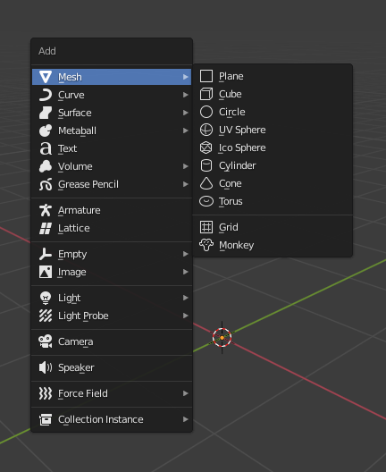
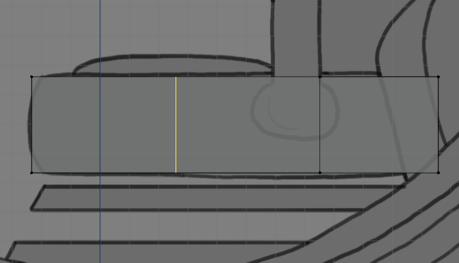
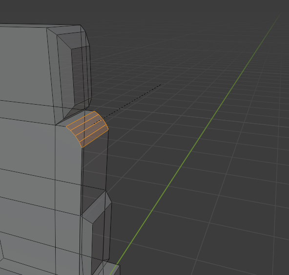

# Blender shortcuts
List of blender shortcuts so that I don't forget them. Will be adding them while I am going through a book

| Name                                           | Image                                            | Shortcut                                                     |
| ---------------------------------------------- | ------------------------------------------------ | ------------------------------------------------------------ |
| View pie menu                                  |         | `Alt+Q`                                                      |
| Local view                                     |              | `Numpad/` Divided by symbol                                  |
| Clear location / Reset location to Zero.       |                                                  | `Alt+G`                                                      |
| Change mode                                    |            | `Tab`                                                        |
| Change to Vertex, Edge, Face mode              |  | `1, 2, 3` on the top of keyboard.                            |
| Deselect                                       |                                                  | `Empty space click` or `Alt+A`                               |
| Select all                                     |                                                  | `A`                                                          |
| Edge loop                                      |                | `Alt + an edge in edge loop`                                 |
| Shortest path                                  |        | `Ctrl + an edge in the edge loop`                            |
| Transformation Keys                            |                                                  | `G` -> Translate `R` -> Rotate `S` -> Scale `Enter/Left Click` -> Accept transformation `Esc/Right Click` -> Cancel transformation |
| Transformation along axis                      |                                                  | After `G/R/S` press `X` -> Along X `Y`-> Along Y `Z` -> Along Z `Shift+X` -> Along Y, Z `Shift+Y` -> Along X,Z `Shift+Z` -> Along X,Y Enter value for exact transformation, e.g. `G, X -> 0.1` Translate along X 0.1m |
| Toggle Quad View                               |                | `Ctrl+Alt+Q`                                                 |
| Snap menu                                      |                | `Shift + S`                                                  |
| Add menu                                       |                  | `Shift + A`                                                  |
| Loop cut                                       |                  | `Ctrl + R`                                                   |
| Bevel                                          |              | `Ctrl + B`                                                   |
| Merge - Used to merge two vertices, faces etc. |                                                  | `M`                                                          |
| Duplicate Objects                              |                                                  | `Shift + D`                                                  |
